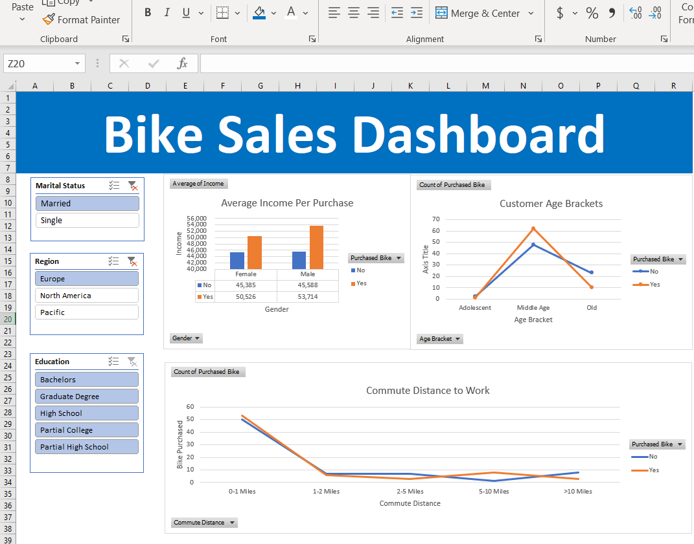

# Bike Sales Dashboard with Excel

## Goal 

The goal of this project was to create a dashboard from the Bike Sales Data. To accomplish this, I have highlighted customers' income, age, and commute distance to work and used this information in a nice easy to visual format!

## Key features 

- Removing duplicates, a feature found in Data Menu

- Find and Replace used to standardize letters into words
  - i.e F = Female, M = Males, M = Married and S = Single

- Using "IF" statements to categorize age into age brackets:
  - =IF(L2>54,"Old",IF(L2>=31,"Middle Age",IF(L2<31,"Adolescent","invalid")))

- Pivot tables are used to create tables which is crucial for graphs and charts

- Merging cells to create a title band and adding Slicer to further filter data found in the Analyze menu

## Screenshots

### Bike Sales Dashboard

